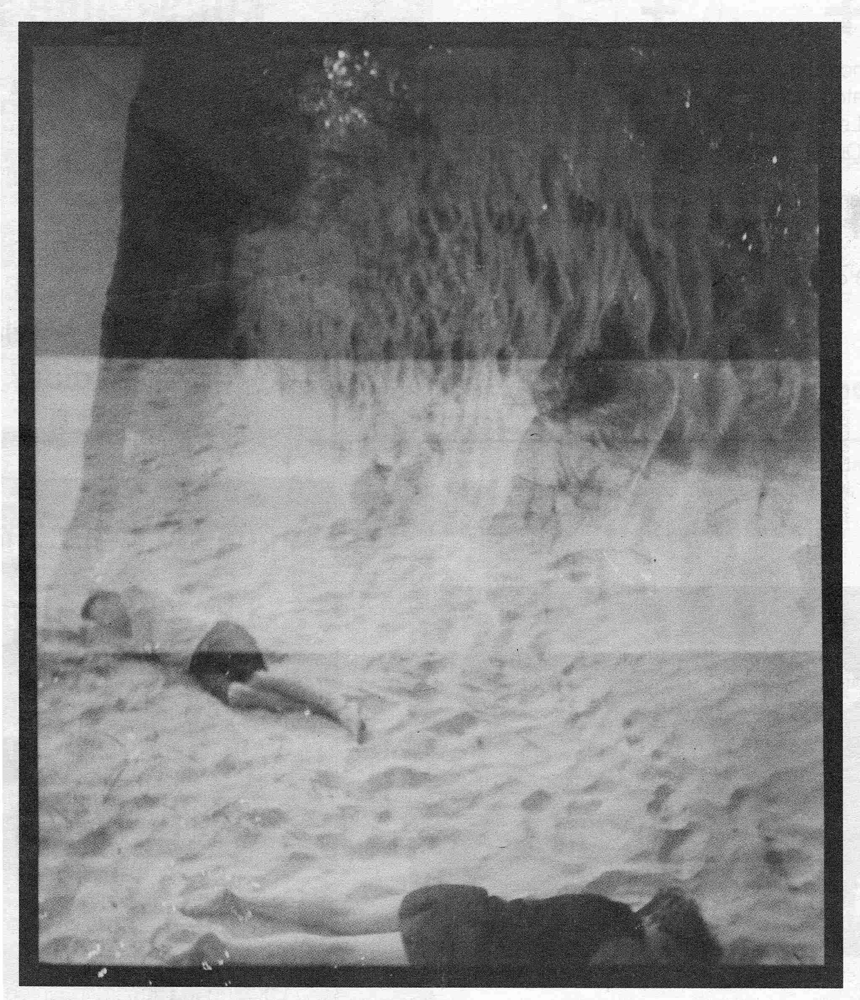
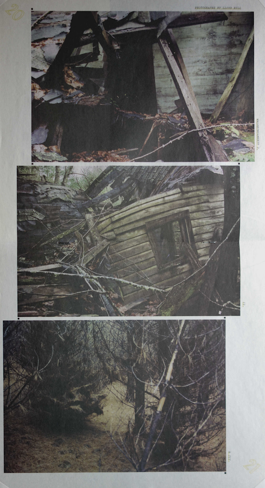

## Photography, etc. 

  
Collages

  A series of original postcards. 2020. 

  
Prints

  Linoleum prints of electron micrographs of diatoms, radiolaria, foram. 2012. 

  
Newsprint
 

In a future where everyone's tired of ice cream from the future. *Metabolism* Volume 6 Issue 3, Sep. 2011.  

Waldeinsamkeit I, II, and III. *Metabolism* Volume 7 Issue 1, Apr. 2012.

